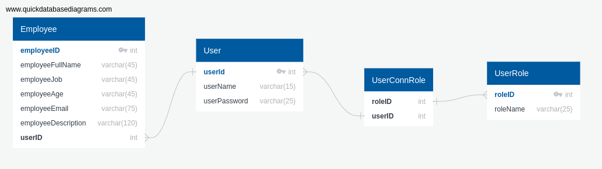

# EmployeeSystem
It is a simple system for managing employees, depending on the user's role. The system has three user roles: the simple User, the Assistant, and the Director, and a user can have one or multiple roles. Also, the roles have a hierarchy:

**1st: Director:** He can Delete, Update, Add, and Read all employees

**2nd: Assistant:** He can do anything like the Director, except Delete employees

**3rd: User:** He can only Read all Employees

When a user logs in to the system, he gets an Access Token with a 2-minute lifetime. In this 2-minute range, he can use his rights based on hierarchy, but if he doesn't log out or refresh the page, he continues seeing the employees' information.

## Implementation Description
This system has 3 parts: The front (user page), the back (APIs), and the database (user and employee data). In this phase, all parts had developed to execute locally, specifically:

**The front:** This React project uses Vite and Typescript. It offers a simple and completely functional UI and sends requests using axios. Based on the responses, the front allows users to connect, and manage the employees by providing users sufficient feedback for each action. Normally, the front needs more work to solve some issues (like the alert messages and some design details), but in this case, we focus on backend development (i.e. the API), and the front provides a more realistic (for ThunderClient) environment for testing the API. Front repository, https://github.com/GiorgosDen/EmployeeSystemFrontend

**The back:** This is a NodeJS project that contains the APIs to communicate with the Database. It is responsible for following the regulations in the user's communication with the database, and providing the appropriate authorization. To test the API, I used the ThunderClient in Visual Studio. Back repository, https://github.com/GiorgosDen/EmployeeSystemBackend

**The database:** The MySQL workbench was used. The database has 4 tables: User, Employee, UserRole, and UserConnRol. Database repository.....

## Photos
### Data Base Structure 

### Test Back in VS Code
I have too many things to show from testing the back, but I will be trying to provide screenshots of the most important functions:
For address localhost:3500/:
1. Success Login (POST request)

For address localhost:3500/homePage:
1. Success Get Request (returns the employees)
   
3. Conflict Error (refers to PUT & POST Requests)
   
5. Unauthorized Error (refers to POST,  PUT,  DELETE Requests)
   
7. Forbidden Error (refers to all Requests)
   
### See Front in Browser 
